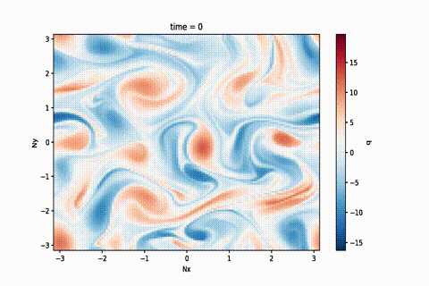
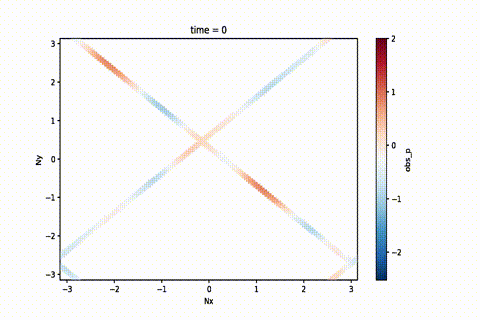
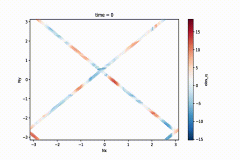

# Quasi-Geostropic Mapping Data Challenge 2022b

This repository contains codes and samples notebooks for generating and processing the QG mapping data challenge.


Steam Function       |  Potential Vorticity
:-------------------------:|:-------------------------:
   |   
   |   

## Motivation (TODO)


---
## Installation

We have some source code available needed for the data loading, data visualization and statistics. To install please run the following command:

```bash
conda env create -f environments.yml
conda activate dc_2022b_qg
```

---
## Data

You can download the file needed for the data challenge here:

```bash
wget -P data/ https://ige-meom-opendap.univ-grenoble-alpes.fr/thredds/fileServer/meomopendap/extract/dc2022b_q/qg_sim.nc
```


Check [here](https://ige-meom-opendap.univ-grenoble-alpes.fr/thredds/catalog/meomopendap/extract/dc2022b_q/catalog.html) for the available files.


---
## Evaluation (TODO)

You will also find an example of evaluation notebook using the baseline method. The reconstuctions shall be stored in a NetCDF file compliant with the format used in this Notebook.


### Leaderboard

| Method     |   µ(RMSE) |   σ(RMSE) |   λx (dx=1) |   λt (dt=1) | Notes                     | Reference        |
|:-----------|------------------------:|---------------------:|-------------------------:|-----------------------:|:--------------------------|:-----------------|
| baseline  :trophy: |                    **???** |                 **???** |            **???** |        **???** | Simplest | eval/.ipynb |
| | | | | | | |


**µ(RMSE)**: average RMSE score.  
**σ(RMSE)**: standard deviation of the RMSE score.  
**λx**: minimum spatial scale resolved.  
**λt**: minimum time scale resolved. 


---
## Special Thanks

### QG Model

The original QG model was taken from Hugo. It can be found [here](https://github.com/hrkz/torchqg). I have forked a branch which has a refactored version which has the notebook to generate the data. This can be found [here](https://github.com/jejjohnson/torchqg/tree/package).

### Statistics

Many of the statistical techniques for evaluating the reconstructions have been used in the previous data challenges: [2020a](https://github.com/ocean-data-challenges/2020a_SSH_mapping_NATL60), [2021a](https://github.com/ocean-data-challenges/2021a_SSH_mapping_OSE), and [2022a](https://github.com/maxbeauchamp/2022a_SPDE_GP_mapping) (To be released). We want to thank the authors for their contributions.